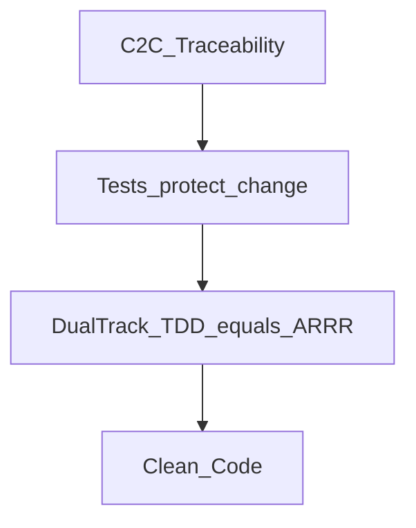
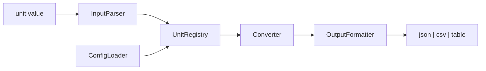

# UnitConverter 작업 계획서

English version: [WORK_PLAN.md](WORK_PLAN.md).

무엇을, 어떤 순서로, 어떤 규칙 아래 만들지에 대한 단일 기준 문서. [AGENTS.md](AGENTS.md)와 `.cursor/rules/*`를 따르는 시니어 아키텍처 엔지니어 관점으로 작성한다.

## 1. 목표와 산출물 범위

- 레거시 길이 변환기를 추적 가능하고 테스트 우선이며 OCP/SRP를 만족하는 CLI로 재구현한다.
- 확정 사항:
  - 범위: 전체 프로젝트 로드맵 (문서 + 스캐폴딩 + ARRR/TDD 구현).
  - 문서: 이중 언어 (`name.md` + `name.ko.md`), 동기화 유지.
  - 가이드 파일명: 영문 슬러그.
  - REFACTOR 브랜치명: `refactor` (`refactoring` 아님).
- 구조/규칙 참고 프로젝트: `C:\Users\usejen_id\workspace\MagicSquare_1004`.
- 원격: `https://github.com/olive-su/UnitConverter_02.git`. 로컬 브랜치: `red` (사이클 1 — D-CNV-02 RED 완료).

## 2. 입력 자료

- 보강된 가이드 `guide/` (Phase 0 완료).
- 원본 `goinfre/` (아카이브 참고).
- 현재 시드: `UnitConverter.py` (37줄, if/elif 분기), `README.md`.
- 하네스: `AGENTS.md`, `.cursor/rules/*`, `harness/*`.
- 마스터 세션 프롬프트: `docs/MASTER_PROMPT.md` (+ `.ko.md`).

## 3. 제품 요약 (가이드 01/02 기준)

- 입력 형식: `unit:value` (예: `meter:2.5`).
- 기본 단위: meter, feet, yard. 비율: `1m = 3.28084 ft = 1.09361 yd`. feet<->yard는 meter 경유.
- 품질: OCP, SRP, 입력 검증 (음수, 형식, 미지 단위).
- P1 확장: 설정 파일 비율(JSON/YAML), 동적 단위 등록, 출력 포맷 `--format json|csv|table`.

## 4. 추적표 (목표 테스트 ID)

| ID | 요구 | Track | 우선순위 |
|----|------|-------|----------|
| FR-01 | `meter:2.5` 파싱 | A/B | P0 |
| FR-02 | 전 단위 출력 | B | P0 |
| FR-03 | 미지 단위 오류 | A/B | P0 |
| FR-04 | 음수 거부 | A | P0 |
| FR-05 | 잘못된 형식 오류 | A | P0 |
| NFR-01 | OCP: 단위 추가 시 변환기 비수정 | B | P0 |
| NFR-02 | SRP: Parser/Registry/Converter/Formatter 분리 | - | P0 |
| EXT-01 | 설정에서 비율 로드 | B | P1 |
| EXT-02 | 동적 등록 | B | P1 |
| EXT-03 | 출력 포맷 | A | P1 |

구현하는 모든 테스트는 위 ID 하나를 인용한다.

## 5. 북극성 — C2C와 ARRR

목표: 개념에서 코드로(C2C) 추적성 — 모든 요구가 테스트 ID와 파일 경로에 매핑된다.



- ARRR과 Dual-Track TDD는 별도 방법론이 아니라 같은 사이클이다.
- Ask = RED, Respond = GREEN, Refine = REFACTOR, Repeat = 다음 RED 묶음.
- Track B: `tests/entity/` — 도메인 로직, 도메인 목 금지.
- Track A: `tests/boundary/` — CLI/파서/포맷터, 도메인 목 허용.
- [guide/06_dualtrack-red-design.ko.md](guide/06_dualtrack-red-design.ko.md) 참고.

## 6. 단계별 로드맵 (MagicSquare_1004 순서)

| Phase | 브랜치 | MagicSquare 대응 | 상태 |
|-------|--------|------------------|------|
| 0 — guide/ | — | — | **완료** |
| 1 — Spec | `spec` | Report 01~05 | **완료** (PR [#2](https://github.com/olive-su/UnitConverter_02/pull/2) open) |
| 2 — Scaffolding | `spec` | Report 04 Step 2 | **완료** (`cb868da`, PR #2) |
| 3 — RED | `red` | Report 06~08 | **사이클 1 부분** — D-CNV-01·02 RED 완료 (PR [#4](https://github.com/olive-su/UnitConverter_02/pull/4) open; D-CNV-02 미커밋) |
| 4 — GREEN | `green` | Report 08~09 | **사이클 1 부분** — D-CNV-01 완료 (PR [#6](https://github.com/olive-su/UnitConverter_02/pull/6) open) |
| 5 — REFACTOR | `refactor` | Report 12 | 대기 (번들 추가 후 또는 스멜 발생 시) |
| 6 — Repeat | `red`→`green`→`refactor` | Report 13 | **진행 중** — 사이클 1: D-CNV-01 GREEN 완료; D-CNV-02 RED 완료 |
| 7 — P1 | `new_features` (선택) | — | 대기 |

### ARRR 묶음 진행 (사이클 1 — Track B P0)

| 묶음 | Test ID | RED | GREEN | REFACTOR | Report |
|------|---------|-----|-------|----------|--------|
| 1 | D-CNV-01 `to_meter` | **완료** `a38dff6` · Issue [#3](https://github.com/olive-su/UnitConverter_02/issues/3) | **완료** `2b0f01e` · Issue [#5](https://github.com/olive-su/UnitConverter_02/issues/5) | — | 06, 07 |
| 2 | D-CNV-02 `convert_all` | **완료** (로컬, 미커밋) | **다음** | — | 08 |
| 3 | D-CNV-03 feet→yard meter 경유 | 대기 | — | — | — |

`main` 대상 열린 PR (머지 전): #2 (`spec`), #4 (`red`), #6 (`green`). `main`은 `a4a8f45` 유지.

### 브랜치 SSOT

```text
main → spec → red → green → refactor → (사이클 반복) → new_features
```

| 브랜치 | ARRR | 수정 범위 |
|--------|------|-----------|
| `spec` | 준비 | docs, `.cursor/`, `Report/`, `Prompting/`, harness |
| `red` | Ask=RED | `tests/`만 |
| `green` | Respond | `src/` + 해당 tests |
| `refactor` | Refine | 구조만 (계약 불변) |

단계 전환 시: 브랜치 전환, 영문 이슈, 커밋(사용자 요청 시), 푸시(사용자 확인), 영문 PR·리뷰어(9장).

### Phase 0 — guide/ 문서 세트 (완료)

- `guide/` 인덱스 + 보강된 이중 언어 가이드 6개(영문 슬러그).
- 파일별 명세는 12장 참고.

### Phase 1 — Spec (완료)

브랜치: `spec`. `cb868da`로 납품. PR 리뷰 수정 요청 시에만 추가 작업.

산출물:

1. **Mom Test** (에이전트 자체 시뮬레이션, MagicSquare Report 01~03 패턴):
   - Role 1: 인터뷰어 — Mom Test 규칙, 질문 1개, 솔루션 제안 금지.
   - Role 2: 페르소나 — 6시간 AI 실습 Activities 수업생이며, ft/m 스펙·스프레드시트 재입력·잘못된 비율로 ~20분 손실 등 실무 단위 변환 고통도 겪는 사용자.
   - 3턴 인터뷰 → 표면 vs 진짜 문제 → Mom Test 증거 3줄 → R-G-I-O 워크북 → 성공 기준 3개.
   - `Report/01.REPORT.md`~`03`, `Prompting/01`~`03`.
2. **PRD**: Mom Test + guide/01 + guide/02로 `docs/PRD.md` (+ `.ko.md`) — 범위, Mom Test 근거 배제, 추적표, 인수 예시.
3. **Cursor ARRR 하네스** (커맨드/스킬 파일만, 테스트 실행 없음):
   - Commands: `/red-test-plan`, `/red-skeleton`, `/green-minimal`, `/golden-master`, `/refactor-smell`, `/refactor-safe`, `/export-session`, `/export`.
   - Skills: `unit-converter-tdd`, `unit-converter-docs` (+ report/transcript/checklist 템플릿).
   - SSOT: `WORK_PLAN.md`, `guide/`, `AGENTS.md`. 톤: MagicSquare_1004 커맨드.
   - `Report/04.REPORT.md`, `Prompting/04.Export-Transcript.md` (Cursor 4그룹 가이드).
4. **규칙**: `.cursor/rules/*.mdc`와 harness 사용 — 루트 `.cursorrules` 중복 생성 금지.

Git 게이트 (Phase 2 스캐폴딩 후 `spec`에서 단일 통합 PR):

- 이슈: `spec: PRD, Mom Test evidence, ARRR cursor harness, and project scaffolding`
- `main` 대상 PR, 리뷰어(9장).

### Phase 2 — Scaffolding (완료)

Phase 1과 함께 `spec`에 납품 (`cb868da`).

- `pyproject.toml`: `[tool.pytest.ini_options]`의 `testpaths`, `pythonpath`, 선택 `[dev]=pytest`.
- [guide/04_target-architecture.ko.md](guide/04_target-architecture.ko.md) 골격:
  - `src/entity/`, `src/boundary/` (MagicSquare 계층).
  - `tests/conftest.py`, `tests/_approval.py`, `tests/golden/`, `tests/entity/`, `tests/boundary/`.
  - 샘플 `units.json`.
- 골격만 — RED/GREEN 구현 본문 없음.

### Phase 3 — RED Ask + Skeleton (`red` 브랜치)

- **D-CNV-01 완료**: `tests/entity/test_d_cnv_01.py`, Report 06, 커밋 `a38dff6`.
- **D-CNV-02 완료**: `tests/entity/test_d_cnv_02.py`, Report 08 (커밋 대기).
- `spec` PR 머지 후: `main`에서 `git checkout -b red` (팀 플로우에 따라 묶음별 브랜치 유지 가능).
- [guide/06_dualtrack-red-design.ko.md](guide/06_dualtrack-red-design.ko.md) Dual-Track RED.
- 워크플로: `/red-test-plan` → `/red-skeleton`. Track B 우선.
- RED 규칙: `src/` 변경 금지, `pytest.fail("RED: ...")` 허용, skip/xfail 금지, 1 RED 묶음 = 1 커밋.
- 세션마다 Report/Prompting, 종료 시 `/export`.

### Phase 4 — GREEN (`green` 브랜치)

- **D-CNV-01 완료**: `src/entity/converter.py` (`to_meter`), Report 07, 커밋 `2b0f01e`, pytest 1 passed.
- `red` PR 머지 후: `main`에서 `git checkout -b green`.
- `/green-minimal` → `/golden-master`.
- 최소 구현만; 안정 출력에 Golden Master.

### Phase 5 — REFACTOR (`refactor` 브랜치)

- `green` PR 머지 후: `main`에서 `git checkout -b refactor`.
- `/refactor-smell` (Ask) → `/refactor-safe` (Agent). 계약 불변.

### Phase 6 — Repeat 사이클

RED 묶음 순서 (Track B 우선, MagicSquare 패턴):

1. **사이클 1 (Track B P0)**: D-CNV-01 → D-CNV-02 → D-CNV-03.
2. **사이클 2 (Track A P0)**: U-IN-01 → U-IN-02 → U-IN-03 → U-OUT-01.
3. **사이클 3 (Track B P1)**: D-REG-01, D-CFG-01.
4. **사이클 4 (Track A P1)**: EXT-03 출력 포맷.

각 묶음: RED 커밋 → GREEN 커밋 → REFACTOR 커밋 → `/export` → Report/Prompting 번호 증가.

### Phase 7 — P1 확장 (선택)

- P0 사이클 완료 후 `new_features` 브랜치에서 EXT-01~03.

### 런타임 데이터 흐름



## 7. Report와 Prompting

MagicSquare_1004 SSOT:

- 디렉터리: 루트 `Report/`, `Prompting/`.
- 파일: `Report/NN.REPORT.md`, `Prompting/NN.Export-Transcript.md` (NN = 세션 순번, 예: `01`, `02`).
- 구현 세션 종료 시 `/export` 또는 `/export-session`.
- 템플릿: `.cursor/skills/unit-converter-docs/`:
  - `report-template.md`
  - `transcript-template.md`
  - `phase-checklist.md`

Report 구조: 요약 표 → 핵심 결정 → 변경 파일 → pytest 결과 → 다음 단계 → 관련 문서 링크.

## 8. `.cursor/` ARRR 하네스

Commands (슬래시명만 — 추가 질문 금지):

| 파일 | 슬래시 |
|------|--------|
| `.cursor/commands/red-test-plan.md` | `/red-test-plan` |
| `.cursor/commands/red-skeleton.md` | `/red-skeleton` |
| `.cursor/commands/green-minimal.md` | `/green-minimal` |
| `.cursor/commands/golden-master.md` | `/golden-master` |
| `.cursor/commands/refactor-smell.md` | `/refactor-smell` |
| `.cursor/commands/refactor-safe.md` | `/refactor-safe` |
| `.cursor/commands/export-session.md` | `/export-session` |
| `.cursor/commands/export.md` | `/export` |

Skills:

| 경로 | 역할 |
|------|------|
| `.cursor/skills/unit-converter-tdd/SKILL.md` | ARRR, Dual-Track, RED 규칙 |
| `.cursor/skills/unit-converter-docs/SKILL.md` | Report/Prompting + 3 템플릿 |

ARRR 사이클 슬래시 워크플로:

```text
/red-test-plan → /red-skeleton → /green-minimal → /golden-master → /refactor-smell → /refactor-safe → /export
```

## 9. Git, 이슈, PR 계약

- 이슈·PR 제목·본문: **영문**.
- PR 리뷰어 (`gh pr create --reviewer`):

| 이름 | GitHub |
|------|--------|
| 권용환 | `yhkwon0817` |
| 김정화 | `jhgomi` |
| 박교현 | `curiosus` |
| 박영민 | `okpym` |

단계 전환 체크리스트:

1. pytest 실행(해당 phase 범위), Report에 결과 기록.
2. `/export`로 `Report/NN` + `Prompting/NN` 생성.
3. 사용자 요청 시 Conventional Commits(영문)로 커밋.
4. 사용자 명시 확인 후에만 푸시.
5. `gh issue create` (영문, phase/trace 태그).
6. `gh pr create` (영문, 위 리뷰어, test plan 체크리스트).

제목 예시:

- `spec: add PRD, Mom Test evidence, ARRR harness, and scaffolding`
- `red: D-CNV-01 failing skeleton (Track B)`
- `green: minimal to_meter for D-CNV-01`
- `refactor: extract ratio constants (contract unchanged)`

## 10. 프로젝트 레이아웃

```text
UnitConverter_02/
├── .cursor/commands/          # ARRR 슬래시 커맨드
├── .cursor/skills/            # unit-converter-tdd, unit-converter-docs
├── docs/PRD.md, MASTER_PROMPT.md
├── guide/                     # Phase 0 (완료)
├── src/entity/, src/boundary/
├── tests/entity/, tests/boundary/, tests/golden/
├── Report/, Prompting/
├── harness/
└── pyproject.toml
```

## 11. 실행 규칙

- 이중 언어: 가독 `*.md`는 `.md` + `.ko.md`. `.cursor/rules/*.mdc`는 영문 전용.
- 커밋: 영문 Conventional Commits; 1 논리 단위 = 1 커밋; 1 RED 묶음 = 1 커밋.
- 푸시: 사용자 명시 확인 없이 금지.
- 코드/문서/커밋에 이모지 금지.
- 단계 완료 정의: 범위 내 테스트 통과, 양 언어 문서 갱신, 해당 시 Report/Prompting + 세션 로그.

## 12. guide/ 문서 세트 (Phase 0 참고)

- 위치: `guide/`. 각 파일: `name.md` + `name.ko.md`.
- 스타일: 개조식, 이모지 금지, 한 페이지 한 목표.

| 파일 | 역할 |
|------|------|
| `00_Guide.md` | 인덱스·읽기 순서 |
| `01_prd-summary.md` | 제품 개요 |
| `02_traceability-matrix.md` | FR/NFR/EXT → 테스트 ID |
| `03_legacy-seed-analysis.md` | 레거시 스멜 |
| `04_target-architecture.md` | 모듈 구조 |
| `05_arrr-7steps.md` | ARRR·브랜치 전략 |
| `06_dualtrack-red-design.md` | Dual-Track RED 표 |

## 13. 현재 포커스

- **진행**: Phase 0~2 완료; D-CNV-01 RED+GREEN 완료; **D-CNV-02 RED** 완료 (로컬).
- **로컬 브랜치**: `red`. 열린 PR: #2, #4, #6 → `main` (머지·리뷰 대기).
- **다음 실행**: D-CNV-02 **GREEN** on `green` — `/green-minimal` → `convert_all` 최소 구현.
- **진입 프롬프트**: [docs/MASTER_PROMPT.ko.md](docs/MASTER_PROMPT.ko.md) (Spec); ARRR는 슬래시 커맨드.
