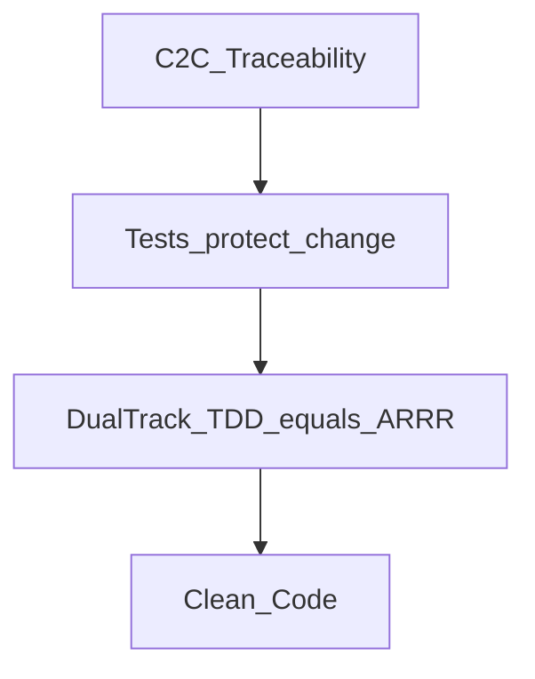
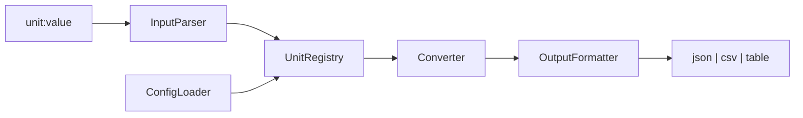

# UnitConverter Work Plan

Korean version: [WORK_PLAN.ko.md](WORK_PLAN.ko.md).

Single source of truth for what to build, in what order, and under which rules. Authored as a senior architecture engineer per [AGENTS.md](AGENTS.md) and `.cursor/rules/*`.

## 1. Goal and Deliverable Scope

- Re-implement the legacy length converter as a traceable, test-first, OCP/SRP-clean CLI.
- Confirmed decisions:
  - Scope: full project roadmap (docs + scaffolding + ARRR/TDD implementation).
  - Docs: bilingual (`name.md` + `name.ko.md`), kept in sync.
  - Guide filenames: English slugs.
  - REFACTOR branch name: `refactor` (not `refactoring`).
- Reference project for structure and conventions: `C:\Users\usejen_id\workspace\MagicSquare_1004`.
- Remote: `https://github.com/olive-su/UnitConverter_02.git`. Local branch: `red` (Cycle 1 — D-CNV-03 RED done).

## 2. Inputs

- Enriched guides in `guide/` (Phase 0 complete).
- Original sources in `goinfre/` (archived reference).
- Current seed: `UnitConverter.py` (37 lines, if/elif branching), `README.md`.
- Harness: `AGENTS.md`, `.cursor/rules/*`, `harness/*`.
- Master session prompt: `docs/MASTER_PROMPT.md` (+ `.ko.md`).

## 3. Product Summary (from guides 01/02)

- Input format: `unit:value` (e.g. `meter:2.5`).
- Base units: meter, feet, yard. Ratios: `1m = 3.28084 ft = 1.09361 yd`. feet<->yard via meter.
- Quality: OCP, SRP, input validation (negative, format, unknown unit).
- P1 extensions: config-file ratios (JSON/YAML), dynamic unit registration, output format `--format json|csv|table`.

## 4. Traceability (target test IDs)

| ID | Requirement | Track | Priority |
|----|-------------|-------|----------|
| FR-01 | Parse `meter:2.5` | A/B | P0 |
| FR-02 | Output all units | B | P0 |
| FR-03 | Unknown unit error | A/B | P0 |
| FR-04 | Reject negative | A | P0 |
| FR-05 | Invalid format error | A | P0 |
| NFR-01 | OCP: add unit, no converter edit | B | P0 |
| NFR-02 | SRP: Parser/Registry/Converter/Formatter split | - | P0 |
| EXT-01 | Load ratios from config | B | P1 |
| EXT-02 | Dynamic registration | B | P1 |
| EXT-03 | Output formats | A | P1 |

Every implemented test must cite one ID above.

## 5. North Star — C2C and ARRR

Goal: concept-to-code (C2C) traceability — every requirement maps to a test ID and a file path.



- ARRR and Dual-Track TDD are the same cycle, not separate methodologies.
- Ask = RED, Respond = GREEN, Refine = REFACTOR, Repeat = next RED bundle.
- Track B: `tests/entity/` — domain logic, no domain mocks.
- Track A: `tests/boundary/` — CLI/parser/formatter, domain mocks allowed.
- See [guide/06_dualtrack-red-design.md](guide/06_dualtrack-red-design.md).

## 6. Phased Roadmap (MagicSquare_1004 order)

| Phase | Branch | MagicSquare analog | Status |
|-------|--------|-------------------|--------|
| 0 — guide/ | — | — | **Done** |
| 1 — Spec | `spec` | Report 01~05 | **Done** (PR [#2](https://github.com/olive-su/UnitConverter_02/pull/2) open) |
| 2 — Scaffolding | `spec` | Report 04 Step 2 | **Done** (in `cb868da`, PR #2) |
| 3 — RED | `red` | Report 06~10 | **Cycle 1 partial** — D-CNV-01·02·03 RED done (PR [#4](https://github.com/olive-su/UnitConverter_02/pull/4) open) |
| 4 — GREEN | `green` | Report 07~09 | **Cycle 1 partial** — D-CNV-01·02 GREEN done (PR [#6](https://github.com/olive-su/UnitConverter_02/pull/6) open) |
| 5 — REFACTOR | `refactor` | Report 12 | Pending (defer until Cycle 1 GREEN complete or smells) |
| 6 — Repeat | `red`→`green`→`refactor` | Report 13 | **In progress** — Cycle 1: D-CNV-01·02 RED+GREEN done; D-CNV-03 RED done |
| 7 — P1 | `new_features` (optional) | — | Pending |

### ARRR bundle progress (Cycle 1 — Track B P0)

| Bundle | Test ID | RED | GREEN | REFACTOR | Reports |
|--------|---------|-----|-------|----------|---------|
| 1 | D-CNV-01 `to_meter` | **Done** `a38dff6` · Issue [#3](https://github.com/olive-su/UnitConverter_02/issues/3) | **Done** `2b0f01e` · Issue [#5](https://github.com/olive-su/UnitConverter_02/issues/5) | — | 06, 07 |
| 2 | D-CNV-02 `convert_all` | **Done** `fe7d672` · Issue [#7](https://github.com/olive-su/UnitConverter_02/issues/7) | **Done** `0b3cd3e` | — | 08, 09 |
| 3 | D-CNV-03 feet→yard via meter | **Done** | **Next** | — | 10 |

Open PRs to `main` (not merged as of last update): #2 (`spec`), #4 (`red`), #6 (`green`). `main` still at `a4a8f45`.

### Branch SSOT

```text
main → spec → red → green → refactor → (repeat cycles) → new_features
```

| Branch | ARRR | Edit scope |
|--------|------|------------|
| `spec` | prep | docs, `.cursor/`, `Report/`, `Prompting/`, harness |
| `red` | Ask=RED | `tests/` only |
| `green` | Respond | `src/` + matching tests |
| `refactor` | Refine | structure only (contract unchanged) |

On phase transition: switch branch, English issue, commit (when user asks), push (user confirms), English PR with reviewers (see section 9).

### Phase 0 — guide/ documentation set (complete)

- `guide/` index plus six enriched bilingual guides (English slugs).
- Per-file spec retained in section 12 for reference.

### Phase 1 — Spec (complete)

Branch: `spec`. Delivered in `cb868da`. No further Spec work unless PR review requests changes.

Deliverables:

1. **Mom Test** (agent self-simulation, MagicSquare Report 01~03 pattern):
   - Role 1: interviewer — Mom Test rules, one question at a time, no solution pitching.
   - Role 2: persona — lab student in the 6-hour AI activities course who also hits real unit-conversion pain (spec sheets in ft/m, spreadsheet re-entry, wrong ratio costing ~20 minutes).
   - 3 interview turns → surface vs real problem → Mom Test evidence (3 lines) → R-G-I-O workbook → 3 success criteria.
   - `Report/01.REPORT.md` through `Report/03.REPORT.md`, `Prompting/01` through `Prompting/03`.
2. **PRD**: `docs/PRD.md` (+ `.ko.md`) from Mom Test + guide/01 + guide/02 — scope, out-of-scope with Mom Test rationale, traceability, acceptance examples.
3. **Cursor ARRR harness** (command/skill files only; no test execution):
   - Commands: `/red-test-plan`, `/red-skeleton`, `/green-minimal`, `/golden-master`, `/refactor-smell`, `/refactor-safe`, `/export-session`, `/export`.
   - Skills: `unit-converter-tdd`, `unit-converter-docs` (+ report/transcript/checklist templates).
   - SSOT: `WORK_PLAN.md`, `guide/`, `AGENTS.md`. Tone: MagicSquare_1004 commands.
   - `Report/04.REPORT.md`, `Prompting/04.Export-Transcript.md` (Cursor 4-group guide).
4. **Rules**: use `.cursor/rules/*.mdc` and harness — do not add a duplicate root `.cursorrules`.

Git gate (after Phase 2 scaffolding on `spec`, single combined PR):

- Issue: `spec: PRD, Mom Test evidence, ARRR cursor harness, and project scaffolding`
- PR to `main` with reviewers (section 9).

### Phase 2 — Scaffolding (complete)

Delivered with Phase 1 on `spec` (`cb868da`).

- `pyproject.toml`: `[tool.pytest.ini_options]` with `testpaths`, `pythonpath`, optional `[dev]=pytest`.
- Package skeleton per [guide/04_target-architecture.md](guide/04_target-architecture.md):
  - `src/entity/`, `src/boundary/` (MagicSquare layering).
  - `tests/conftest.py`, `tests/_approval.py`, `tests/golden/`, `tests/entity/`, `tests/boundary/`.
  - sample `units.json`.
- Skeleton only — no RED/GREEN implementation bodies yet.

### Phase 3 — RED Ask + Skeleton (`red` branch)

- **D-CNV-01 done**: `tests/entity/test_d_cnv_01.py`, Report 06, commit `a38dff6`.
- **D-CNV-02 done**: `tests/entity/test_d_cnv_02.py`, Report 08, commit `fe7d672`.
- **D-CNV-03 done**: `tests/entity/test_d_cnv_03.py`, Report 10.
- After `spec` PR merged: `git checkout -b red` from `main` (or continue bundle branches per team flow).
- Dual-Track RED from [guide/06_dualtrack-red-design.md](guide/06_dualtrack-red-design.md).
- Workflow: `/red-test-plan` → `/red-skeleton` per bundle. Track B first.
- RED rules: no `src/` changes, `pytest.fail("RED: ...")` allowed, no skip/xfail, one RED bundle = one commit.
- Report/Prompting per session; `/export` at session end.

### Phase 4 — GREEN (`green` branch)

- **D-CNV-01 done**: `src/entity/converter.py` (`to_meter`), Report 07, commit `2b0f01e`.
- **D-CNV-02 done**: `convert_all` minimal impl, Report 09, commit `0b3cd3e`, pytest 2 passed.
- After `red` PR merged: `git checkout -b green` from `main`.
- `/green-minimal` → `/golden-master` for passing tests.
- Minimal implementation only; Golden Master for stable output.

### Phase 5 — REFACTOR (`refactor` branch)

- After `green` PR merged: `git checkout -b refactor` from `main`.
- `/refactor-smell` (Ask) → `/refactor-safe` (Agent). Contract unchanged.

### Phase 6 — Repeat cycles

RED bundle order (Track B priority, MagicSquare pattern):

1. **Cycle 1 (Track B P0)**: D-CNV-01 → D-CNV-02 → D-CNV-03.
2. **Cycle 2 (Track A P0)**: U-IN-01 → U-IN-02 → U-IN-03 → U-OUT-01.
3. **Cycle 3 (Track B P1)**: D-REG-01, D-CFG-01.
4. **Cycle 4 (Track A P1)**: EXT-03 output formats.

Each bundle: RED commit → GREEN commit(s) → REFACTOR commit(s) → `/export` → Report/Prompting number increments.

### Phase 7 — P1 extensions (optional)

- Branch `new_features` for EXT-01~03 after P0 cycles complete.

### Runtime data flow



## 7. Report and Prompting

MagicSquare_1004 SSOT:

- Directories: root `Report/`, `Prompting/`.
- Files: `Report/NN.REPORT.md`, `Prompting/NN.Export-Transcript.md` (NN = session sequence, e.g. `01`, `02`).
- End every implementation session with `/export` or `/export-session`.
- Templates in `.cursor/skills/unit-converter-docs/`:
  - `report-template.md`
  - `transcript-template.md`
  - `phase-checklist.md`

Report structure: summary table → key decisions → changed files → pytest result → next steps → related doc links.

## 8. `.cursor/` ARRR harness

Commands (slash name only — no follow-up questions):

| File | Slash |
|------|-------|
| `.cursor/commands/red-test-plan.md` | `/red-test-plan` |
| `.cursor/commands/red-skeleton.md` | `/red-skeleton` |
| `.cursor/commands/green-minimal.md` | `/green-minimal` |
| `.cursor/commands/golden-master.md` | `/golden-master` |
| `.cursor/commands/refactor-smell.md` | `/refactor-smell` |
| `.cursor/commands/refactor-safe.md` | `/refactor-safe` |
| `.cursor/commands/export-session.md` | `/export-session` |
| `.cursor/commands/export.md` | `/export` |

Skills:

| Path | Role |
|------|------|
| `.cursor/skills/unit-converter-tdd/SKILL.md` | ARRR, Dual-Track, RED rules |
| `.cursor/skills/unit-converter-docs/SKILL.md` | Report/Prompting + 3 templates |

Slash workflow per ARRR cycle:

```text
/red-test-plan → /red-skeleton → /green-minimal → /golden-master → /refactor-smell → /refactor-safe → /export
```

## 9. Git, Issue, and PR contract

- Issue and PR titles and bodies: **English**.
- PR reviewers (`gh pr create --reviewer`):

| Name | GitHub |
|------|--------|
| Kwon Yonghwan | `yhkwon0817` |
| Kim Jeonghwa | `jhgomi` |
| Park Gyohyun | `curiosus` |
| Park Youngmin | `okpym` |

Phase transition checklist:

1. Run pytest (phase scope); record result in Report.
2. Create `Report/NN` + `Prompting/NN` via `/export`.
3. Commit with Conventional Commits (English) when user requests.
4. Push only after explicit user confirmation.
5. `gh issue create` (English title/body, phase/trace tags).
6. `gh pr create` (English, reviewers above, test plan checklist).

Example titles:

- `spec: add PRD, Mom Test evidence, ARRR harness, and scaffolding`
- `red: D-CNV-01 failing skeleton (Track B)`
- `green: minimal to_meter for D-CNV-01`
- `green: minimal convert_all for D-CNV-02`
- `red: D-CNV-03 failing skeleton (Track B)`
- `refactor: extract ratio constants (contract unchanged)`

## 10. Project layout

```text
UnitConverter_02/
├── .cursor/commands/          # ARRR slash commands
├── .cursor/skills/            # unit-converter-tdd, unit-converter-docs
├── docs/PRD.md, MASTER_PROMPT.md
├── guide/                     # Phase 0 (done)
├── src/entity/, src/boundary/
├── tests/entity/, tests/boundary/, tests/golden/
├── Report/, Prompting/
├── harness/
└── pyproject.toml
```

## 11. Execution rules

- Bilingual: every human-readable `*.md` ships `.md` + `.ko.md`. `.cursor/rules/*.mdc` stay English-only.
- Commits: English, Conventional Commits; one logical unit per commit; one RED bundle = one commit.
- Push: never without explicit user confirmation.
- No emojis in code, docs, or commits.
- Definition of done per phase: scoped tests pass, both-language docs updated, Report/Prompting + session log when applicable.

## 12. guide/ documentation set (Phase 0 reference)

- Location: `guide/`. Each file: `name.md` + `name.ko.md`.
- Style: terse bullets, no emojis, one goal per page.

| File | Role |
|------|------|
| `00_Guide.md` | Index and read order |
| `01_prd-summary.md` | Product overview |
| `02_traceability-matrix.md` | FR/NFR/EXT to test ID |
| `03_legacy-seed-analysis.md` | Legacy smells |
| `04_target-architecture.md` | Module layout |
| `05_arrr-7steps.md` | ARRR / branch strategy |
| `06_dualtrack-red-design.md` | Dual-Track RED tables |

## 13. Current focus

- **Progress**: Phases 0–2 complete; D-CNV-01·02 RED+GREEN done; **D-CNV-03 RED** done (local).
- **Local branch**: `red`. Open PRs: #2, #4, #6 → `main` (awaiting merge/review).
- **Next execution**: D-CNV-03 **GREEN** on `green` — `/green-minimal` → `convert_all`에 `yard` 추가.
- **Entry prompt**: [docs/MASTER_PROMPT.md](docs/MASTER_PROMPT.md) (Spec); use slash commands for ARRR cycles.
