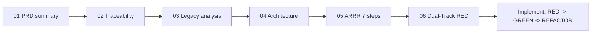

# UnitConverter 가이드 세트

English version: [00_Guide.md](00_Guide.md).

UnitConverter 프로젝트의 토대 가이드. 문제 정의에서 테스트 우선·OCP/SRP 클린 구현까지 이어준다. 이 인덱스를 먼저 읽고 아래 순서를 따른다.

## 목적

- 무엇을 만들지(PRD) 정의하고 테스트로 추적 가능함을 증명한다.
- 레거시 시드를 진단하고 목표 아키텍처를 설정한다.
- ARRR / Dual-Track TDD로 구현을 이끈다.

## 가이드 한눈에 보기

| # | 가이드 | 흐름 내 역할 | 출처 |
|---|--------|--------------|------|
| 01 | [PRD 요약](01_prd-summary.ko.md) | 무엇을 만드는가 (요구, 비율, P1 확장) | goinfre/01 |
| 02 | [추적표](02_traceability-matrix.ko.md) | 모든 요구를 테스트 ID에 매핑 | goinfre/02 |
| 03 | [레거시 시드 분석](03_legacy-seed-analysis.ko.md) | 현재 코드가 왜 문제인가 | goinfre/03 |
| 04 | [목표 아키텍처](04_target-architecture.ko.md) | 모듈 구조 (OCP/SRP) | goinfre/04 |
| 05 | [ARRR 7단계](05_arrr-7steps.ko.md) | 방법론 (RED-GREEN-REFACTOR) | goinfre/05 |
| 06 | [Dual-Track RED 설계](06_dualtrack-red-design.ko.md) | 최초 실패 테스트 (Track A/B) | goinfre/06 |

## 흐름

## 읽기 순서

1. 01 PRD 요약 — 제품과 인수 기준 이해.
2. 02 추적표 — 각 요구를 테스트 ID에 고정.
3. 03 레거시 시드 분석 — 설계가 제거할 스멜 파악.
4. 04 목표 아키텍처 — 코딩 전 모듈 분리 학습.
5. 05 ARRR 7단계 — 워크플로와 브랜치 전략 채택.
6. 06 Dual-Track RED 설계 — 최초 실패 테스트 작성.

## 재방문 시점

- 새 요구 전: 02로 테스트 ID 부여, 06으로 RED 묶음 설계.
- 새 모듈 전: 04로 경계(entity/boundary/control) 유지.
- 커밋 전: 05로 RED-GREEN-REFACTOR 리듬과 커밋 규칙 확인.

## 관련 문서

- [WORK_PLAN.ko.md](../WORK_PLAN.ko.md) — 단계별 프로젝트 로드맵.
- `docs/PRD.md` — 정식 PRD (Phase 1에서 생성).
- [AGENTS.ko.md](../AGENTS.ko.md) — 에이전트 행동 계약.

## 규칙

- 각 가이드는 이중 언어: `name.md`(영문) + `name.ko.md`(국문), 동기화 유지.
- 개조식, 이모지 금지, 한 페이지 한 목표.
