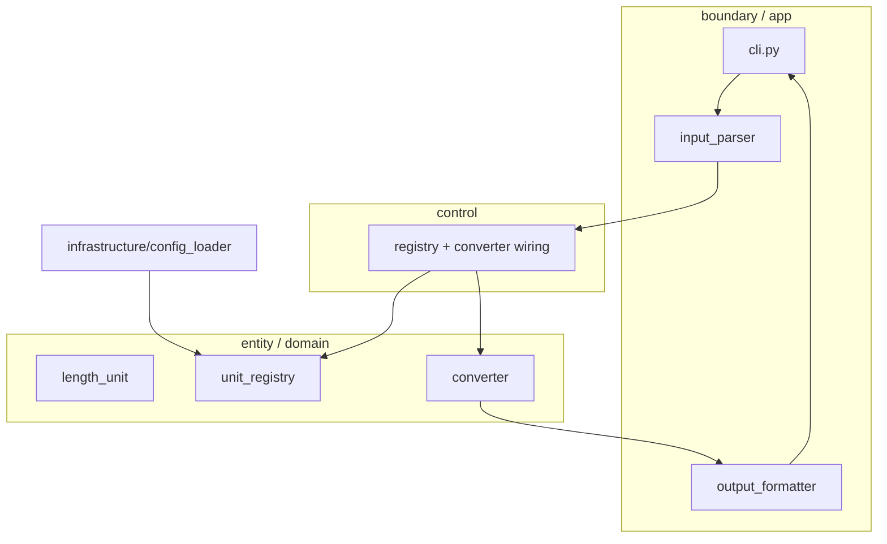

# 04. 목표 아키텍처 (Python)

English version: [04_target-architecture.md](04_target-architecture.md). 출처: `goinfre/04`, `MagicSquare_1004`와 정합.

OCP·SRP를 만족하고 테스트 우선을 유지하는 모듈 구조.

## 패키지 구조

```text
unit_converter/
├── domain/
│   ├── length_unit.py     # Protocol: name, to_meter()
│   ├── unit_registry.py   # 등록 / 조회 (OCP 핵심)
│   └── converter.py       # meter 값 -> 전 단위 (SRP)
├── infrastructure/
│   └── config_loader.py   # JSON / YAML
├── app/
│   ├── input_parser.py    # "unit:value"
│   └── output_formatter.py # json | csv | table
└── cli.py
tests/
├── conftest.py            # 공유 픽스처 (SSOT)
├── test_converter.py      # 도메인 (Track B)
└── test_cli.py            # 경계 (Track A)
```

## OCP — 개방-폐쇄

- 새 단위 = `LengthUnit` 구현 + `registry.register()` (또는 설정 1줄).
- 단위 추가로 변환기 코드를 수정하지 않는다.

## SRP — 단일 책임

- 변환 != 파싱 != 출력 != 설정 로드.
- 4개 모듈: Parser, Registry, Converter, Formatter.

## MagicSquare_1004의 규칙

- 계층화: `src/{entity,boundary,control}`. 본 프로젝트 매핑:
  - `entity` = `domain/` (순수 로직, I/O 없음).
  - `boundary` = `app/` + `cli.py` (입출력, 포맷팅).
  - `control` = 필요 시 오케스트레이션 (예: registry + converter 결선).
- ECB 규칙: `entity`는 `boundary`/`control` import 금지. 도메인은 의존성 없음 유지.
- 테스트 분리: `tests/entity/` (Track B, 도메인 목 금지), `tests/boundary/` (Track A, 도메인 목 허용).
- 골든 마스터 하네스: `tests/_approval.py` + `tests/golden/`, `UPDATE_GOLDEN=1` 환경 플래그로 갱신.
- SSOT 픽스처는 `tests/conftest.py`; 매직 넘버(비율, 정밀도)는 `constants.py`.
- 패키징: `pyproject.toml`의 `[tool.pytest.ini_options]` (`testpaths`, `pythonpath = ["."]`), 선택 `[dev] = pytest`.

## 계층 지도



## 다음

- 워크플로 채택: [05 ARRR 7단계](05_arrr-7steps.ko.md).
