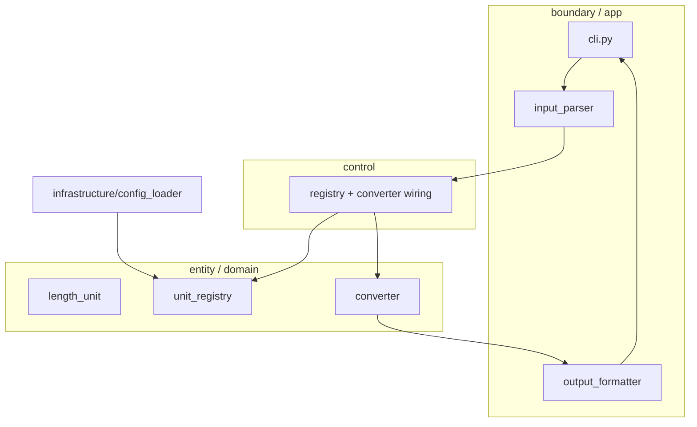

# 04. Target Architecture (Python)

Korean version: [04_target-architecture.ko.md](04_target-architecture.ko.md). Source: `goinfre/04`, reconciled with `MagicSquare_1004`.

Module layout that satisfies OCP and SRP and stays test-first.

## Package Structure

```text
unit_converter/
├── domain/
│   ├── length_unit.py     # Protocol: name, to_meter()
│   ├── unit_registry.py   # register / lookup (OCP core)
│   └── converter.py       # meter value -> all units (SRP)
├── infrastructure/
│   └── config_loader.py   # JSON / YAML
├── app/
│   ├── input_parser.py    # "unit:value"
│   └── output_formatter.py # json | csv | table
└── cli.py
tests/
├── conftest.py            # shared fixtures (SSOT)
├── test_converter.py      # domain (Track B)
└── test_cli.py            # boundary (Track A)
```

## OCP — Open/Closed

- New unit = a `LengthUnit` implementation + `registry.register()` (or one config line).
- Converter code is never modified to add a unit.

## SRP — Single Responsibility

- Conversion != parsing != output != config load.
- Four modules: Parser, Registry, Converter, Formatter.

## Conventions from MagicSquare_1004

- Layering: `src/{entity,boundary,control}`. Map to this project:
  - `entity` = `domain/` (pure logic, no I/O).
  - `boundary` = `app/` + `cli.py` (input/output, formatting).
  - `control` = orchestration when needed (e.g. wiring registry + converter).
- ECB rule: `entity` must not import `boundary`/`control`. Domain stays dependency-free.
- Test split: `tests/entity/` (Track B, no domain mocks) and `tests/boundary/` (Track A, domain mocks allowed).
- Golden Master harness: `tests/_approval.py` + `tests/golden/`, refreshable via an `UPDATE_GOLDEN=1` env flag.
- SSOT fixtures live in `tests/conftest.py`; magic numbers (ratios, precision) live in a `constants.py`.
- Packaging: `pyproject.toml` with `[tool.pytest.ini_options]` (`testpaths`, `pythonpath = ["."]`), optional `[dev] = pytest`.

## Layer Map



## Next

- Adopt the workflow: [05 ARRR 7 Steps](05_arrr-7steps.md).
